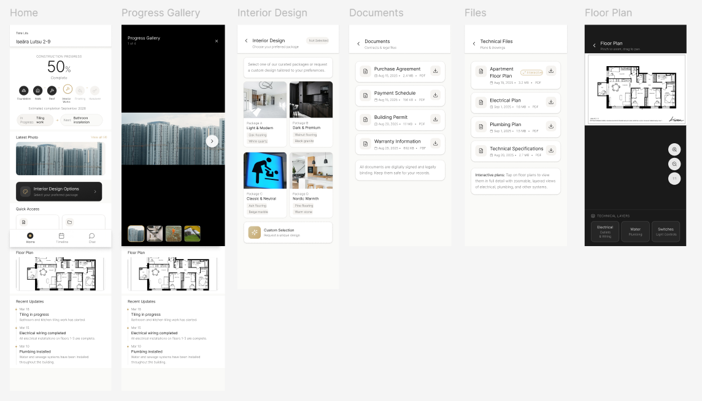

# KoDuDemo

KoDuDemo is a product prototype built during the Garage48 Empowering Women Hackathon.

Event:
- Garage48 Empowering Women Hackathon
- https://garage48.org/events/empoweringwomen

## Team KoDu

- Patricia Malm - Team Lead
- Diana Michelson - Designer
- Ethel Laul - Designer
- Kadi Kerner - Developer
- Sille Laas - Marketing

## Problem And Vision

Home-buyers and real estate developers often manage design choices, documents, and progress updates across fragmented channels.

KoDu aims to unify that experience into one product with two connected sides:
- Customer side (home-buyer view)
- Real estate developer side

Important:
- This is a working code prototype, not a Figma-only concept.

## Hackathon Goal

Deliver, within hackathon time, a functional prototype that demonstrates:
- Liisi customer experience (mobile-first)
- Anu developer experience (tablet-first)
- design package comparison and selection flow
- project progress visibility
- document and gallery management
- activity and status timeline

Delivery target:
- Demo-ready working prototype by March 22, 14:00

## Current Scope (In Progress)

Customer side, Liisi mobile views:
- Home / apartment overview
- Design package comparison + selection
- Documents
- Gallery
- Progress status
- Activity feed

Developer side, Anu tablet views (design pending, implementation starts as input arrives):
- Project dashboard overview
- Customer progress snapshot
- Design package and decision status
- Documents and media management
- Timeline / activity status

Data source:
- Mock data only for hackathon speed

## Tech Stack

- Next.js (App Router)
- TypeScript
- Tailwind CSS
- shadcn/ui

## Development Rules

- Commit often
- Keep code, code comments, and commit messages in English
- Follow clean code and good engineering practices
- Prefer feature branches and merge to main only when stable

## Quick Start

1. Install dependencies:

```bash
npm install
```

2. Run development server:

```bash
npm run dev
```

3. Open:

```text
http://localhost:3000
```

Windows PowerShell note:
- If script policy blocks npm/npx, use `npm.cmd` and `npx.cmd`.

## Project Structure

- `src/app` - pages and app routing
- `src/components` - UI components
- `src/lib/mockData.ts` - hackathon mock data for apartment, packages, documents, and gallery

## Deployment

Target platform:
- Vercel

Recommended deploy flow:
1. Push feature branch
2. Verify preview build
3. Merge to main when demo flow is stable

## Design Screenshots (WIP)

Liisi view (work in progress):
- Add screenshot file to `docs/images/liisi-wip.png`
- The image will be shown here once the file is added



## What To Add Next In README

Add these details as they become available:
- short product pitch (1 to 2 sentences)
- screenshots or GIF from working prototype
- live demo URL (Vercel)
- API notes (if backend integration starts)
- known limitations and next milestones
